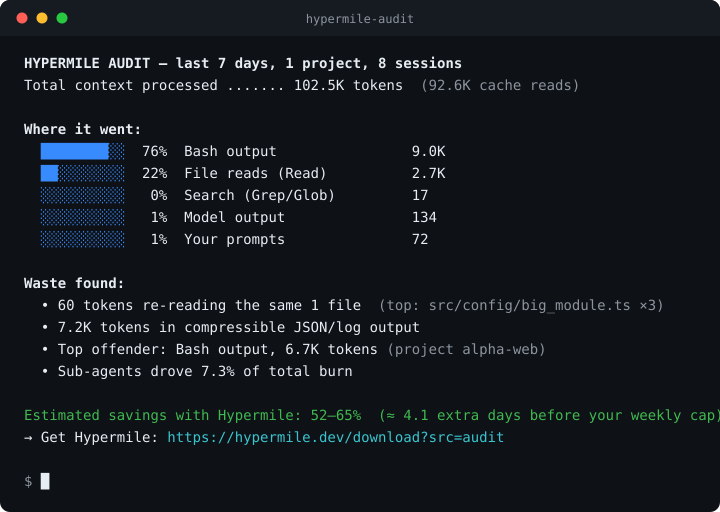

# hypermile-audit

**Your Claude Code usage copilot.** `hypermile-audit` is a free, single-binary CLI
that scans your local Claude Code transcripts and shows you *where your tokens
actually go* — which tools dominate your context, how much is wasted on repeated
file reads and compressible JSON/log output, and roughly how much you could save.
It runs entirely on your machine: **zero network calls, zero telemetry**, no
account. Point it at your `~/.claude` directory and get a report in under a
second.



```
HYPERMILE AUDIT — last 7 days, 1 project, 8 sessions
Total context processed ....... 102.5K tokens  (92.6K cache reads)

Where it went:
  ████████░░  76%  Bash output                9.0K
  ██░░░░░░░░  22%  File reads (Read)          2.7K
  ░░░░░░░░░░   0%  Search (Grep/Glob)         17
  ░░░░░░░░░░   1%  Model output               134
  ░░░░░░░░░░   1%  Your prompts               72

Waste found:
  • 60 tokens re-reading the same 1 file  (top: src/config/big_module.ts ×3)
  • 7.2K tokens in compressible JSON/log output
  • Top offender: Bash output, 6.7K tokens (project alpha-web)
  • Sub-agents drove 7.3% of total burn

Estimated savings with Hypermile: 52–65%  (≈ 4.1 extra days before your weekly cap)
→ Get Hypermile: https://hypermile.dev/download?src=audit
```

_(Both captures above are the tool's real output over the synthetic session
fixtures in `tests/fixtures/` — your numbers will reflect your own transcripts.)_

## Install

### npx (no install)

```
npx hypermile-audit
```

The npm shim downloads the prebuilt binary for your platform from GitHub
Releases on first run (one-time fetch; the audit itself stays 100% offline).

### Prebuilt binaries

Grab the binary for your platform from
[GitHub Releases](https://github.com/adrianph98/hypermile-audit/releases) —
Windows (x64), macOS (Intel/Apple Silicon), and Linux (x64/arm64), named
`hypermile-audit-<target-triple>[.exe]`.

### From source (cargo)

```
cargo install --git https://github.com/adrianph98/hypermile-audit
```

or from a checkout: `cargo install --path .`. Either installs the
`hypermile-audit` binary into `~/.cargo/bin`. Once the public crate is on
crates.io, `cargo install hypermile-audit` also works.

## Usage

```
hypermile-audit                     # scan all projects, last 7 days (default)
hypermile-audit --days 30           # widen the window
hypermile-audit --project alpha     # limit to one project (substring or *-glob)
hypermile-audit --json              # machine-readable JSON to stdout
hypermile-audit --html report.html  # self-contained shareable HTML report
hypermile-audit --claude-dir <dir>  # scan a directory other than ~/.claude
hypermile-audit --redact-paths      # replace file paths with 8-char hashes
hypermile-audit --help              # full flag reference
hypermile-audit --version
```

Output is colored in a terminal and automatically **plain when piped** or when
`NO_COLOR` is set. `--json` writes only the schema below to stdout (any HTML
write status goes to stderr), so it composes cleanly with `jq`:

```
hypermile-audit --json | jq '.savings_pct'
```

## `--json` schema (stable, `"schema": 1`)

```jsonc
{
  "schema": 1,
  "window_days": 7,
  "totals": {
    "tokens": 0,        // total context processed (real API usage numbers)
    "cache_read": 0,    // cache-read subset of the above
    "sessions": 0,      // transcript files scanned
    "projects": 0       // distinct project dirs
  },
  "categories": [       // where estimated tokens went, stable display order
    { "name": "Bash output", "tokens": 0, "pct": 0.0 }
  ],
  "waste": [            // always these five kinds, in this order
    { "kind": "repeated_reads", "tokens": 0, "detail": "…" },
    { "kind": "json_blobs",     "tokens": 0, "detail": "…" },
    { "kind": "log_noise",      "tokens": 0, "detail": "…" },
    { "kind": "huge_output",    "tokens": 0, "detail": "…" },
    { "kind": "sub_agents",     "tokens": 0, "detail": "…" }
  ],
  "savings_pct": { "low": 0.0, "high": 0.0 }
}
```

All keys are `snake_case`. `tokens` fields are integers; `pct`, `low`, and `high`
are numbers rounded to one decimal. The `waste` array always contains the five
kinds above (with `tokens: 0` when a detector found nothing) so consumers can
rely on the shape.

## Privacy FAQ

**Does anything leave my machine?** No. The tool makes **zero network calls** and
sends **zero telemetry**. It only reads `*.jsonl` files under the Claude
directory you point it at.

**Do you print my code or prompts?** Never. The report shows only file *names*,
tool names, and aggregate token counts — never file contents or prompt text. Any
command strings that might ever be surfaced are truncated to 60 characters.

**I want to share a report publicly.** Use `--redact-paths`: every file path is
replaced with a stable 8-character hash (e.g. `path#a1b2c3d4`), so you can post a
report or HTML file without revealing your directory layout.

**License.** MIT. See [LICENSE](LICENSE).

---

Part of [Hypermile](https://hypermile.dev) — tooling to make Claude Code cheaper
and faster.
